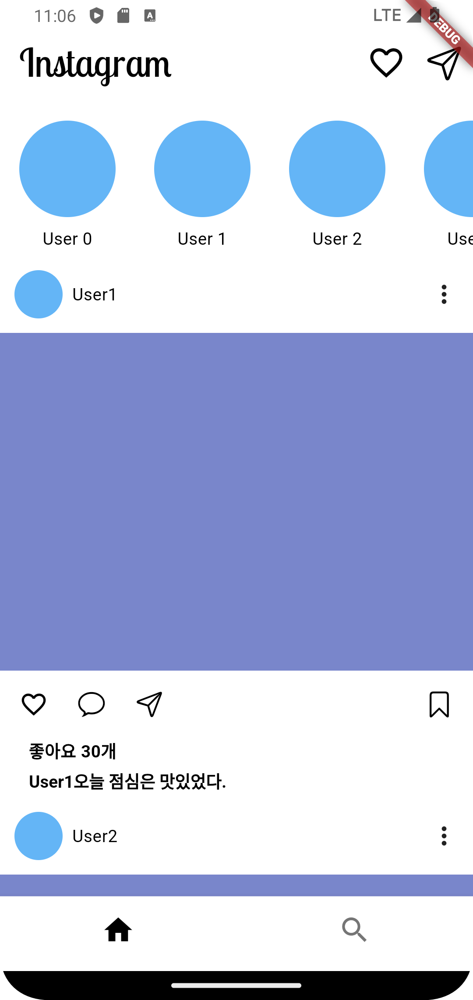
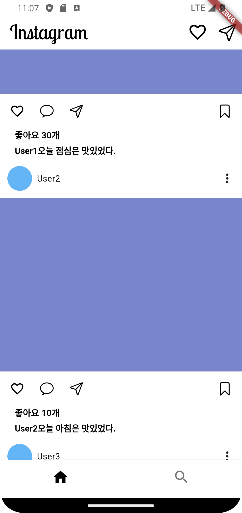
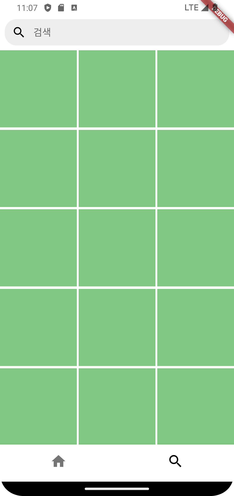
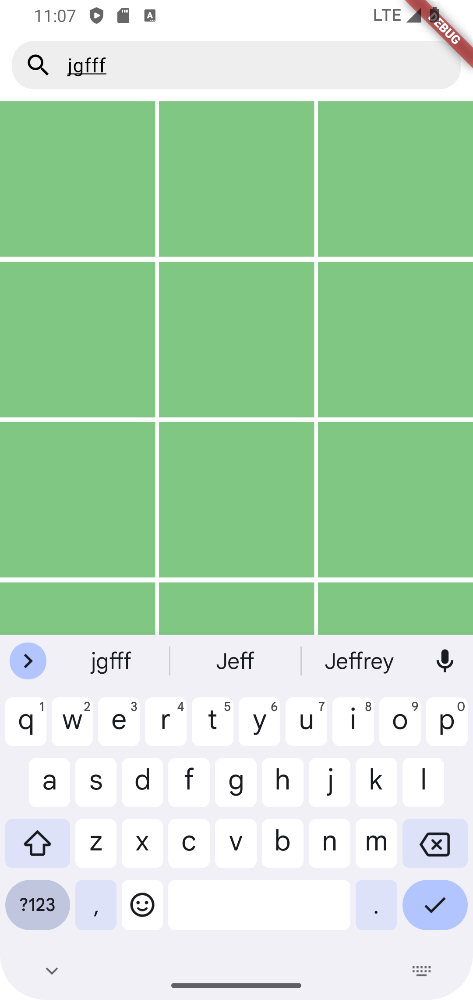

# ex_02_instagram_clone

기본적인 인스타그램 앱입니다.

예시 이미지

    
    
    
    

기능

인스타그램 앱 기본 UI

개선할 점

로그인 기능  
피드 글 확장 기능  
최신 스토리 알림 및 확인  
본인 글 확인 기능  
서버에 사진이나 글 올리기 요청  
서버에 타인의 글 사진 검색 요청  
DM 기능  
